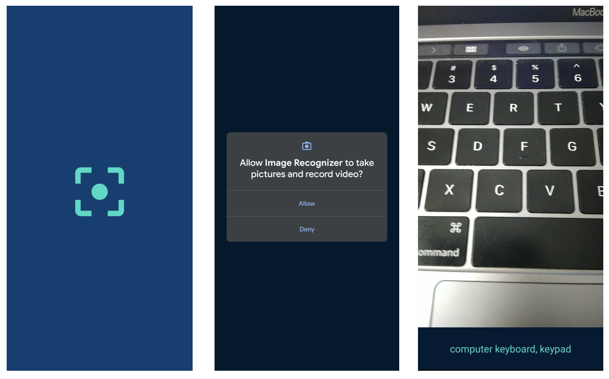

# ImageRecognizer
On-device machine learning on Android using CameraX and PyTorch Mobile

## Modules used
* [PyTorch](https://pytorch.org) for loading ResNet-18 model for inference.
* [PyTorch Mobile for Android](https://pytorch.org/mobile/android/) for on-device machine learning API
* [CameraX](https://developer.android.com/training/camerax) for camera feed development.

## Features
* Low-latency on-device image analysis.
* Runs seamlessly on any Android device above Android version 5.0.

## Screenshots

